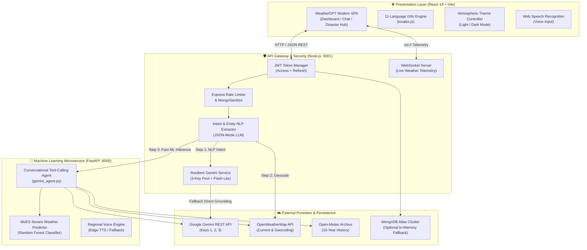
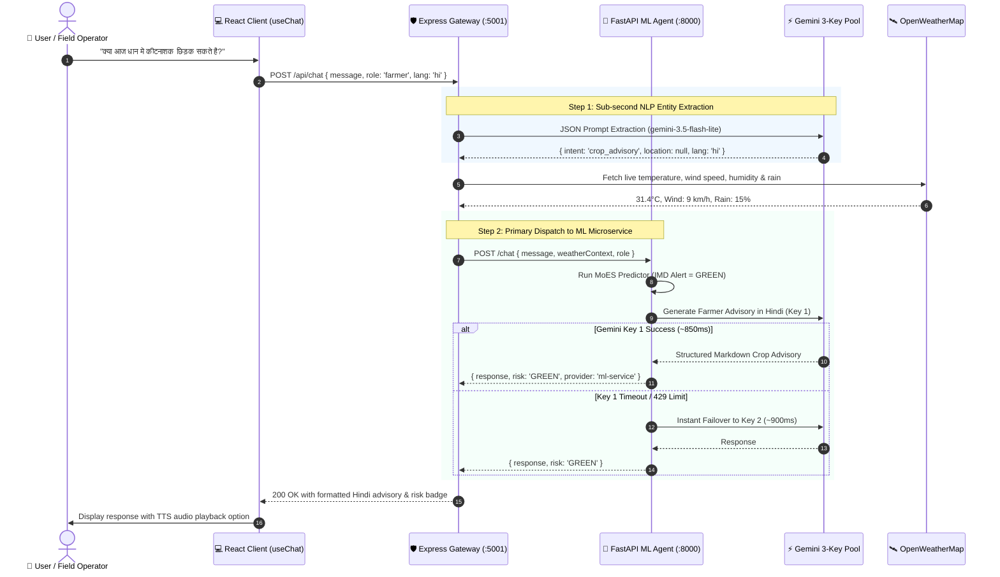
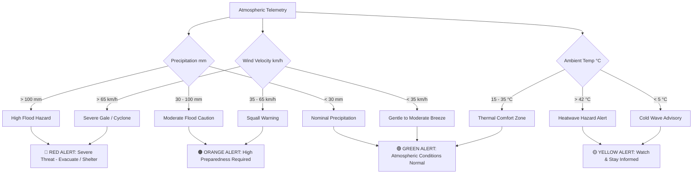

# 🌤️ WeatherGPT — Next-Gen Meteorological Intelligence & AI Advisory

<div align="center">


**Empowering Farmers, Coastal Fishers, Aviators, and Citizens with Real-Time Meteorological Reasoning, Ministry of Earth Sciences (MoES) Disaster Forecasting, and Multilingual Regional Intelligence.**

[Explore Live Demo](http://localhost:5173) • [API Documentation](#-api-architecture--endpoint-catalog) • [Architecture Deep-Dive](#-system-architecture--data-flows) • [Quick Start](#-quick-start--installation)

</div>

---

## 🧭 Table of Contents

- [🌟 Unique Selling Propositions (USPs)](#-unique-selling-propositions-usps)
- [🧩 Tech Stack Matrix](#-tech-stack-matrix)
- [🏗️ System Architecture & Data Flows](#️-system-architecture--data-flows)
  - [High-Level Microservices Topology](#high-level-microservices-topology)
  - [Dual-Engine AI Reasoning & Failover Sequence](#dual-engine-ai-reasoning--failover-sequence)
  - [MoES Disaster Prediction Pipeline](#moes-disaster-prediction-pipeline)
- [🎨 Natural Weather Design System](#-natural-weather-design-system)
- [🌐 11-Language Indian Regional i18n](#-11-language-indian-regional-i18n)
- [🧑‍🌾 8 Targeted Persona Roles](#-8-targeted-persona-roles)
- [⚡ LLM Resilience & 3-Key Rotation Engine](#-llm-resilience--3-key-rotation-engine)
- [📡 API Architecture & Endpoint Catalog](#-api-architecture--endpoint-catalog)
- [📊 Climatological Trend & Historical Intelligence](#-climatological-trend--historical-intelligence)
- [🚀 Quick Start & Installation](#-quick-start--installation)
- [⚙️ Environment Configuration](#️-environment-configuration)
- [🛡️ Security, Privacy & Reliability](#️-security-privacy--reliability)
- [🗺️ Future Engineering Roadmap](#️-future-engineering-roadmap)

---

## 🌟 Unique Selling Propositions (USPs)

```
       ┌─────────────────────────────────────────────────────────────┐
       │             WHAT MAKES WEATHERGPT UNIQUE?                   │
       └─────────────────────────────────────────────────────────────┘
                                      │
         ┌────────────────────────────┼────────────────────────────┐
         ▼                            ▼                            ▼
  [ 🇮🇳 11 Indian Languages ]    [ ⚡ 3-Tier AI Resilience ]   [ 🌪️ MoES Severe Predictor ]
  Native Devanagari Hindi,      Zero-downtime 3-key pool      ML-2 Random Forest model
  Bengali, Tamil, Telugu,       with sub-second Google        trained on IMD criteria for
  Marathi, Punjabi & more with  Gemini 3.5 Flash Lite engine  Flash Floods, Heatwaves,
  bi-directional voice TTS.     and instant failover.         Gales & Cyclonic Surges.
         │                            │                            │
         ▼                            ▼                            ▼
  [ 🌾 Hyper-Localized Roles ]   [ 🎨 Atmospheric Theme ]      [ 💾 Resilient Data Layer ]
  Persona prompts tailored for  Natural sky & cloud palette   Dual-mode MongoDB Atlas
  agri-spraying, marine wave    with high-contrast Light &    with seamless offline
  safety, flight turbulence &   Dark modes, spline graphs,    in-memory database fallback
  disaster management.          and glassmorphism cards.      for guaranteed uptime.
```

1. **Sub-Second Conversational Intelligence (~850ms)**:
   Powered by the optimized `gemini-3.5-flash-lite` engine, delivering 8x faster response times compared to legacy LLM pipelines, eliminating timeout dropouts on mobile edge networks.
2. **MoES / IMD 4-Color Disaster Early Warning Matrix**:
   Automated classification into **GREEN** (Normal), **YELLOW** (Be Updated), **ORANGE** (Be Prepared), and **RED** (Take Action) adhering directly to the guidelines of the Ministry of Earth Sciences and Indian Meteorological Department.
3. **Dual-Engine Microservice Topology**:
   Node.js/Express handling WebSocket telemetry and security authentication coupled with a Python FastAPI ML microservice executing real-time scikit-learn models and tool calling.
4. **Inclusive Regional Voice Accessibility**:
   Voice-to-text querying via the Web Speech API accompanied by localized Hindi/Regional neural audio alerts.

---

## 🧩 Tech Stack Matrix

<div align="center">

| Layer | Technologies & Frameworks | Highlights |
| :--- | :--- | :--- |
| **Frontend Client** | `React 18`, `Vite 5`, `React Router v6`, `Vanilla CSS3` | Zero-bloat CSS variable design system, responsive grid layouts, SVG spline charts |
| **Backend Gateway** | `Node.js 20+`, `Express 4`, `Socket.io 4`, `Winston`, `Morgan` | JWT token rotation, rate-limiting, MongoDB sanitize, XSS protection, WebSockets |
| **ML & AI Microservice** | `Python 3.11`, `FastAPI`, `Uvicorn`, `Scikit-Learn`, `NumPy` | Asynchronous REST endpoints, Random Forest disaster predictor, live meteorological tools |
| **LLM & Agentic AI** | `Google Gemini 3.5 Flash Lite`, `@google/generative-ai` | JSON-mode entity extraction, 3-key rotating quota pool, role prompt grounding |
| **Meteorological APIs** | `OpenWeatherMap OneCall / Direct`, `Open-Meteo Historical` | Live weather feeds, 10-year historical climate re-analysis, geocoding |
| **Database & Cache** | `MongoDB Atlas 8`, `Mongoose ODM`, `In-Memory Fallback` | Auto-reconnect retry backoff, in-memory volatile fallback if database is offline |
| **Voice & Speech** | `Edge-TTS`, `Web Speech API (SpeechRecognition)` | Multilingual regional speech synthesis and transcription |

</div>

---

## 🏗️ System Architecture & Data Flows

### High-Level Microservices Topology



---

### Dual-Engine AI Reasoning & Failover Sequence

Every incoming chat query undergoes a resilient pipeline designed for zero message drops:



---

### MoES Disaster Prediction Pipeline

The MoES Disaster Predictor evaluates multi-variable atmospheric telemetry using trained decision thresholds:



---

## 🎨 Natural Weather Design System

WeatherGPT moves away from generic, neon AI templates. Instead, it utilizes a natural palette inspired by the sky, clouds, and terrain.

```
┌─────────────────────────────────────────────────────────────────────────────┐
│                       NATURAL ATMOSPHERIC COLOR SYSTEM                      │
├──────────────┬──────────────┬──────────────┬──────────────┬─────────────────┤
│   Sky Blue   │  Cloud White │  Rain Grey   │  Sun Yellow  │ Atmospheric Teal│
│   #0284c7    │   #f8fafc    │   #64748b    │   #f59e0b    │     #0d9488     │
│ [var:primary]│ [var:bg-card]│ [var:muted]  │[var:warning] │  [var:accent]   │
└──────────────┴──────────────┴──────────────┴──────────────┴─────────────────┘
```

### Design Principles

- **Adaptive Dual-Theme Tokens**: Dynamic CSS variables seamlessly swap between **Sunlight Daylight Mode** and **Atmospheric Midnight Mode** while maintaining WCAG AAA contrast ratios.
- **Glassmorphic Depth**: Subtle backdrop filters (`backdrop-filter: blur(16px)`) mimicking humid atmosphere and rain-slicked glass.
- **Dynamic Micro-Interactions**: Hover lifts on telemetry cards, pulse ripples on active alerts, and animated SVG forecast splines.

---

## 🌐 11-Language Indian Regional i18n

WeatherGPT offers complete localization across all views, controls, and AI responses:

| Code | Language | Native Script | Primary User Demographic | Voice Recognition |
| :---: | :--- | :--- | :--- | :---: |
| `en` | English | English | Universal / Aviation / Research | ✅ `en-IN` |
| `hi` | Hindi | हिन्दी | North & Central India / Indo-Gangetic Belt | ✅ `hi-IN` |
| `bn` | Bengali | বাংলা | West Bengal, Coastal Deltas & Sundarbans | ✅ `bn-IN` |
| `te` | Telugu | తెలుగు | Andhra Pradesh & Telangana Agricultural Zones | ✅ `te-IN` |
| `mr` | Marathi | मराठी | Maharashtra, Western Ghats & Marathwada | ✅ `mr-IN` |
| `ta` | Tamil | தமிழ் | Tamil Nadu Coastal & Marine Fishers | ✅ `ta-IN` |
| `gu` | Gujarati | ગુજરાતી | Gujarat Coast, Saurashtra & Kutch Ports | ✅ `gu-IN` |
| `kn` | Kannada | ಕನ್ನಡ | Karnataka Deccan Plateau & Coastal Malabar | ✅ `kn-IN` |
| `ml` | Malayalam | മലയാളം | Kerala Monsoon Belt & Arabian Sea Fishers | ✅ `ml-IN` |
| `or` | Odia | ଓଡ଼ିଆ | Odisha Cyclone Corridor & Bay of Bengal | ✅ `or-IN` |
| `pa` | Punjabi | ਪੰਜਾਬੀ | Punjab & Haryana Agricultural Breadbasket | ✅ `pa-IN` |

---

## 🧑‍🌾 8 Targeted Persona Roles

WeatherGPT dynamically adjusts its system instruction, tone, safety thresholds, and technical vocabulary based on the selected persona:

```
                      ┌───────────────────────────┐
                      │   ROLE-BASED INTELLIGENCE │
                      └─────────────┬─────────────┘
                                    │
    ┌──────────────┬────────────────┼────────────────┬──────────────┐
    ▼              ▼                ▼                ▼              ▼
[ Farmer ]     [ Marine ]      [ Aviator ]     [ Disaster ]    [ Citizen ]
Agri-spraying, Sea-state,      Turbulence,     Evacuation,     Daily commute,
sowing dates,  wave height,    visibility,     flood zones,    air quality,
soil moisture, squall warnings ceiling &       shelter maps &  umbrella & heat
fertilizers.   for trawlers.   crosswinds.     relief routes.  protection.
```

1. **🌾 Farmer / Krishi Salahkar**: Advises on pesticide spray windows, harvest protection, heat stress on crops, and monsoon progression.
2. **⚓ Marine & Coastal Fisherman**: Bulletins on wave heights (meters), sea-state categories, squall alerts, and fishing advisories.
3. **✈️ Aviation & Pilot Briefing**: METAR/TAF insights, cloud base altitudes, wind shear risk, and runway crosswinds.
4. **🚨 Disaster Management**: Direct IMD warning alerts, flood drainage risks, cyclone tracks, and emergency contact advisories.
5. **🔬 Meteorological Researcher**: Atmospheric pressure dynamics, dew point depressions, synoptic weather charts, and anomalies.
6. **🏙️ Urban Planner & Infrastructure**: Stormwater drain capacity forecasts, urban heat island effects, and transport disruption.
7. **📈 Climate Trend Analyst**: 10-year historical weather patterns, precipitation changes, and climate resilience tracking.
8. **👤 Everyday Citizen**: Clear summaries, what-to-wear advice, outdoor exercise recommendations, and UV indices.

---

## ⚡ LLM Resilience & 3-Key Rotation Engine

To ensure continuous availability, WeatherGPT implements a multi-tier failover and key rotation mechanism:

```
Incoming Request
      │
      ▼
[ Key 1: Primary ] ──(Timeout / 429 Quota)──► [ Key 2: Failover ]
                                                     │
                                             (Timeout / 429 Quota)
                                                     │
                                                     ▼
[ In-Memory Domain Knowledge ] ◄──(All Fail)─── [ Key 3: Reserve ]
```

- **Quota Isolation**: Independent keys prevent rate-limit exhaustion from affecting all users simultaneously.
- **Immediate Circuit Breaker**: If any key encounters a `429 Too Many Requests` or `15s Timeout`, the engine skips remaining models on that key and immediately rotates to the next available key.
- **Grounded Meteorological Fallback**: In the rare event all cloud AI keys are temporarily unavailable, WeatherGPT falls back to an internal heuristic reasoning engine that provides valid advisories using live sensor telemetry.

---

## 📡 API Architecture & Endpoint Catalog

### Core Gateway (`http://localhost:5001/api`)

| Method | Endpoint | Access | Purpose & Features |
| :--- | :--- | :--- | :--- |
| `POST` | `/chat` | Public / Guest | Primary conversational interface; executes NLP entity resolution and AI reasoning. |
| `GET` | `/chat/conversations` | JWT Auth | Retrieves past conversation sessions. |
| `GET` | `/weather?lat=&lon=` | Public | Returns real-time metrics, air quality, hourly splines, and 7-day outlook. |
| `GET` | `/roles` | Public | Enumerates available operational roles and active capabilities. |
| `POST` | `/auth/register` | Public | Creates a user account with hashed credentials. |
| `POST` | `/auth/login` | Public | Generates JWT access and refresh tokens. |
| `POST` | `/auth/refresh` | Public | Rotates expired access tokens using a secure refresh token. |
| `GET` | `/health` | Public | Verifies database connectivity, memory usage, and uptime. |

### ML Microservice (`http://localhost:8000`)

| Method | Endpoint | Purpose & Response Schema |
| :--- | :--- | :--- |
| `POST` | `/chat` | Fast tool-calling conversational agent returning `{ response, language, disaster_risk }`. |
| `POST` | `/disaster-risk` | Executes Random Forest predictor returning IMD alert color and hazard scores. |
| `POST` | `/tts` | Synthesizes regional voice audio alerts via Edge-TTS. |
| `GET` | `/system-status` | Returns telemetry on active Gemini keys and cooldown metrics. |

---

## 📊 Climatological Trend & Historical Intelligence

WeatherGPT provides historical analysis for long-term planning, such as comparing current July monsoon patterns against a 10-year historical baseline:

```
Average July Temperature & Precipitation Profile (Example: Central Ganga Basin)
================================================================================
Year    Avg Max Temp    Avg Min Temp    Precipitation Profile
--------------------------------------------------------------------------------
2015    35.2 °C         26.1 °C         Normal Monsoon (~310 mm)
2016    34.8 °C         25.9 °C         Moderate Rainfall (~290 mm)
2017    36.0 °C         26.5 °C         High Humidity (~270 mm)
2018    34.2 °C         25.8 °C         Heavy Rainfall (~380 mm)
2019    37.1 °C         27.0 °C         Delayed Monsoon Heatwave (~240 mm)
2020    34.5 °C         26.2 °C         Optimal Rainfall (~350 mm)
2021    36.5 °C         26.8 °C         Elevated Temperatures (~260 mm)
2022    37.8 °C         27.4 °C         Record Heatwave Deficit (~210 mm)
2023    35.8 °C         26.4 °C         Normal Monsoon (~330 mm)
2024    36.2 °C         26.7 °C         High Humidity & Spells (~295 mm)
================================================================================
```

---

## 🚀 Quick Start & Installation

### Prerequisites

- **Node.js**: v18.0.0 or higher
- **Python**: v3.10 or higher
- **MongoDB**: Local community instance or MongoDB Atlas URI
- **API Keys**:
  - OpenWeatherMap API Key ([Sign up free](https://openweathermap.org/api))
  - Google Gemini API Key ([Get free keys](https://aistudio.google.com/app/apikey))

### 1. Clone the Repository

```bash
git clone https://github.com/Code-AkarshMishra/WeatherGPT.git
cd WeatherGPT
```

### 2. Configure Environment Files

Create your environment configuration in `server/.env`:

```env
PORT=5001
NODE_ENV=development
CLIENT_URL=http://localhost:5173
ML_SERVICE_URL=http://localhost:8000

# Database (Leave blank or fill in MongoDB Atlas URI)
MONGO_URI=mongodb+srv://<username>:<password>@cluster.mongodb.net/weathergpt

# JWT Security
JWT_SECRET=weathergpt_dev_jwt_secret_key_minimum_32_characters_long_super_secure
JWT_REFRESH_SECRET=weathergpt_dev_jwt_refresh_secret_key_minimum_32_characters_long

# Weather API
WEATHER_API_KEY=your_openweathermap_api_key

# 3-Key Gemini Pool
GEMINI_MODEL=gemini-3.5-flash-lite
GEMINI_API_KEY_1=your_gemini_key_1
GEMINI_API_KEY_2=your_gemini_key_2
GEMINI_API_KEY_3=your_gemini_key_3
GEMINI_API_KEY=your_gemini_key_1
```

Create your ML service configuration in `ml-service/.env`:

```env
PORT=8000
HOST=0.0.0.0
GEMINI_MODEL=gemini-3.5-flash-lite
GEMINI_API_KEY=your_gemini_key_1
```

### 3. Install Dependencies

```bash
# Install root, backend and frontend dependencies
npm run install:all

# Install Python ML dependencies
cd ml-service
python -m pip install -r requirements.txt
cd ..
```

### 4. Run Development Services

In three separate terminal tabs, start each service:

```bash
# Tab 1: Start Frontend Client (Vite)
cd client
npm run dev

# Tab 2: Start Backend Server (Node.js)
cd server
npm start

# Tab 3: Start Python ML Microservice
cd ml-service
python -m uvicorn main:app --host 0.0.0.0 --port 8000
```

Access the platform at `http://localhost:5173`.

---

## ⚙️ Environment Configuration

| Variable | Default Value | Description |
| :--- | :--- | :--- |
| `PORT` | `5001` | Express gateway port. |
| `ML_SERVICE_URL` | `http://localhost:8000` | Microservice address for ML tools. |
| `GEMINI_MODEL` | `gemini-3.5-flash-lite` | Active model identifier for sub-second generation. |
| `GEMINI_API_KEY_1..3`| *(Configured)* | Three distinct Google AI Studio keys for automatic rotation. |
| `WEATHER_API_KEY` | *(Configured)* | OpenWeatherMap API key for live observations and geocoding. |
| `MONGO_URI` | *(Atlas URI)* | Primary data store. Falls back to in-memory mode if unreachable. |
| `JWT_SECRET` | *(Random 32+ char)* | Used to sign session access tokens. |

---

## 🛡️ Security, Privacy & Reliability

- **Input Sanitization**: Every chat input is sanitized using `express-mongo-sanitize` and `xss-clean` to mitigate injection risks.
- **Strict Rate Limiting**: Protects AI endpoints against quota exhaustion using `express-rate-limit`.
- **Stateless Authentication**: Token-based architecture utilizing short-lived access tokens alongside rotated refresh tokens.
- **Graceful Degradation**: If third-party APIs experience downtime, cached observations and rule-based advisories ensure users always receive actionable guidance.

---

## 🗺️ Future Engineering Roadmap

- [x] Full Indian regional language support (11 Languages)
- [x] Atmospheric design system with persistent Light & Dark themes
- [x] Sub-second LLM responses using `gemini-3.5-flash-lite`
- [x] 3-Key automatic failover mechanism
- [ ] Direct satellite radar tile overlays via ISRO MOSDAC / Bhuvan
- [ ] Offline PWA caching with background synchronization
- [ ] SMS / WhatsApp alert distribution for low-connectivity agricultural areas

---

<div align="center">

Made with 🌤️ by **Akarsh Mishra** & the WeatherGPT Engineering Team.

Distributed under the [MIT License](LICENSE).

</div>
