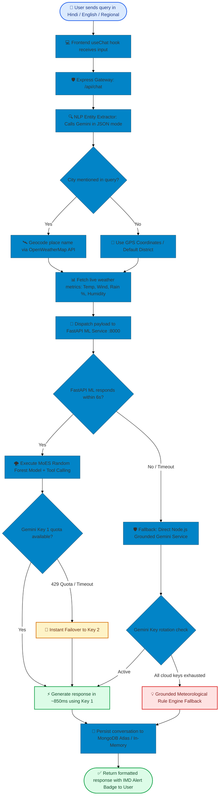

# 🌤️ WeatherGPT — User Guide & System Manual

<div align="center">

<!-- Hero Banner Badges -->
<p align="center">
  
  
  
  
  
  
  
</p>

### 🇮🇳 India's First Multilingual, Multi-Persona AI Meteorological Platform
**Empowering Farmers, Coastal Fishers, Aviators, Disaster Response Teams, and Citizens with Real-Time Meteorological Reasoning & Ministry of Earth Sciences (MoES) Forecasting.**

[✨ Highlights](#-key-features--user-interface) • [⚙️ Quick Environment Setup](#-quick-environment-setup-env) • [🏗️ System Architecture](#-colorful-system-architecture) • [🚀 Quick Start](#-step-by-step-quick-start) • [🎨 Design System](#-ui-design-system--themes)

</div>

---

## 📑 Quick Navigation

1. [✨ Key Features & User Interface (UI)](#-key-features--user-interface)
2. [⚙️ Quick Environment Setup (.env)](#-quick-environment-setup-env)
3. [🏗️ Colorful System Architecture](#-colorful-system-architecture)
4. [🛠️ Tech Stack with Icons](#️-tech-stack-with-icons)
5. [🔄 End-to-End Chat & Failover Flowchart](#-end-to-end-chat--failover-flowchart)
6. [🌪️ MoES 4-Color Disaster Matrix](#️-moes-4-color-disaster-matrix)
7. [🌐 11 Indian Regional Languages Guide](#-11-indian-regional-languages-guide)
8. [🧑‍🌾 8 Targeted Persona Roles](#-8-targeted-persona-roles)
9. [🎨 UI Design System & Themes](#-ui-design-system--themes)
10. [🚀 Step-by-Step Quick Start](#-step-by-step-quick-start)
11. [📡 API Reference Summary](#-api-reference-summary)
12. [❓ Troubleshooting & FAQ](#-troubleshooting--faq)

---

## ✨ Key Features & User Interface (UI)

WeatherGPT brings together professional meteorological telemetry and natural human conversation:

| Feature & Icon | User Capability | Why It Matters |
| :--- | :--- | :--- |
| **🌦️ Atmospheric Intelligence** | Live temperature, humidity, feels-like, wind speed, pressure, UV index, and precipitation. | Comprehensive real-time weather tracking at a single glance. |
| **📈 Interactive Hourly Spline** | Smooth SVG spline chart displaying 24-hour temperature and rainfall progression. | Helps users plan outdoor activities, travel, and farming tasks. |
| **🚨 MoES Disaster Advisories** | Early warning cards aligned with IMD color codes (**Green**, **Yellow**, **Orange**, **Red**). | Crucial safety alerts for storms, flash floods, heatwaves, and cyclones. |
| **🗣️ Voice Query & Audio TTS** | Hands-free microphone input and neural regional voice audio playback. | Accessible for rural farmers, field operators, and elderly users. |
| **🌐 11-Language i18n Switcher** | Dynamic switching across 11 Indian languages without page reloads. | Removes language barriers across India's diverse regions. |
| **🌓 Persistent Theme Switcher** | Seamless toggle between **Sunlight Day Mode** and **Midnight Atmospheric Mode**. | Comfortable viewing in bright outdoor sunlight or at night. |
| **🧑‍🌾 8-Role Specialization Dock** | Instant persona switching (Farmer, Marine, Aviator, Disaster Team, Citizen, etc.). | Tailors advice specifically for farming, fishing, flying, or daily safety. |
| **📊 10-Year Climate History** | Historical re-analysis comparing current conditions with a 10-year baseline. | Uncovers long-term monsoon trends and extreme weather shifts. |

---

## ⚙️ Quick Environment Setup (`.env`)

WeatherGPT uses simple environment variables configured across two service folders:

### 📋 Environment Variables Summary

| Key Name | Service | Status | Purpose & Where to Get Key |
| :--- | :---: | :---: | :--- |
| `WEATHER_API_KEY` | `server/.env` | **Required** | Real-time weather observations & geocoding. [Get Free Key from OpenWeatherMap](https://openweathermap.org/api). |
| `GEMINI_API_KEY_1` | `server/.env` | **Required** | Primary key for sub-second (~850ms) AI generation. [Get Free Key from Google AI Studio](https://aistudio.google.com/app/apikey). |
| `GEMINI_API_KEY_2` | `server/.env` | **Required** | Automatic backup key if Key 1 reaches its quota limit. |
| `GEMINI_API_KEY_3` | `server/.env` | **Required** | Secondary reserve key for continuous failover. |
| `GEMINI_API_KEY` | `ml-service/.env` | **Required** | API key used by the Python ML tool-calling service. |
| `GEMINI_MODEL` | Both | **Preset** | Default is `gemini-3.5-flash-lite` for high-speed response. |
| `MONGO_URI` | `server/.env` | *Optional* | MongoDB connection string. Server switches to safe in-memory mode if offline. |
| `JWT_SECRET` | `server/.env` | **Preset** | 32+ character security secret for session signing. |
| `ML_SERVICE_URL` | `server/.env` | **Preset** | Address of Python microservice (`http://localhost:8000`). |

> 💡 **Quick Start Tip:** Run `cp .env.example server/.env` from the project root and fill in your free `WEATHER_API_KEY` and `GEMINI_API_KEY_1`. You are ready to launch!

---

## 🏗️ Colorful System Architecture

Below is the complete microservices topology of WeatherGPT with color-coded operational boundaries:

```mermaid
%%{init: {'theme': 'base', 'themeVariables': { 'primaryColor': '#38bdf8', 'edgeLabelBackground':'#ffffff', 'tertiaryColor': '#f1f5f9'}}}%%
flowchart TB
    subgraph CLIENT["💻 CLIENT LAYER (React 18 + Vite :5173)"]
        style CLIENT fill:#f0f9ff,stroke:#0284c7,stroke-width:2px
        UI["🖥️ Modern Responsive UI<br/>(Cards, Splines, Alert Badges)"]
        style UI fill:#e0f2fe,stroke:#0369a1,color:#0c4a6e
        i18n["🌐 11-Language i18n Engine<br/>(locales.js)"]
        style i18n fill:#fef3c7,stroke:#d97706,color:#78350f
        Voice["🎙️ Web Speech Recognition<br/>& Audio Output"]
        style Voice fill:#fce7f3,stroke:#db2777,color:#831843
    end

    subgraph GATEWAY["🛡️ API GATEWAY & SECURITY (Node.js + Express :5001)"]
        style GATEWAY fill:#f8fafc,stroke:#475569,stroke-width:2px
        Router["🚦 Express Router & Rate Limiter<br/>(/api/chat, /api/weather, /api/auth)"]
        style Router fill:#f1f5f9,stroke:#334155,color:#0f172a
        NLP["🔍 Fast NLP Intent Extractor<br/>(JSON Structured Mode)"]
        style NLP fill:#ede9fe,stroke:#7c3aed,color:#4c1d95
        Failover["⚡ 3-Key Gemini Pool<br/>(Instant Timeout Failover)"]
        style Failover fill:#dbeafe,stroke:#2563eb,color:#1e3a8a
        WS["📡 WebSocket Telemetry Server<br/>(Real-Time Stream)"]
        style WS fill:#ccfbf1,stroke:#0d9488,color:#115e59
    end

    subgraph ML_SERVICE["🧠 ML MICROSERVICE (Python + FastAPI :8000)"]
        style ML_SERVICE fill:#f0fdf4,stroke:#16a34a,stroke-width:2px
        ToolAgent["🤖 Agentic Tool Caller<br/>(Live Ingest & Persona Grounding)"]
        style ToolAgent fill:#dcfce7,stroke:#15803d,color:#14532d
        Predictor["🌪️ MoES Severe Weather Predictor<br/>(Random Forest Classifier)"]
        style Predictor fill:#fee2e2,stroke:#dc2626,color:#7f1d1d
        TTS["🔊 Regional Audio TTS Service<br/>(Edge-TTS Voice Synthesis)"]
        style TTS fill:#fae8ff,stroke:#a855f7,color:#581c87
    end

    subgraph EXTERNAL["☁️ EXTERNAL DATA & AI CLOUD"]
        style EXTERNAL fill:#fffbeb,stroke:#b45309,stroke-width:2px
        GeminiCloud["✨ Google Gemini AI Cloud<br/>(gemini-3.5-flash-lite)"]
        style GeminiCloud fill:#dbeafe,stroke:#1d4ed8,color:#1e40af
        OWM["🛰️ OpenWeatherMap API<br/>(Current Observations & Geocoding)"]
        style OWM fill:#ffedd5,stroke:#ea580c,color:#7c2d12
        OpenMeteo["📊 Open-Meteo Archive<br/>(10-Year Historical Climate)"]
        style OpenMeteo fill:#fef9c3,stroke:#ca8a04,color:#713f12
        MongoCloud["🍃 MongoDB Atlas / In-Memory<br/>(User Conversations & Cache)"]
        style MongoCloud fill:#d1fae5,stroke:#059669,color:#064e3b
    end

    UI <--> |HTTP / JSON REST| Router
    UI <--> |ws:// Telemetry| WS
    Voice <--> UI
    i18n <--> UI

    Router --> NLP
    NLP --> |Step 1: Parse Entities| Failover
    Failover --> GeminiCloud
    Router --> |Step 2: Microservice Dispatch| ToolAgent
    ToolAgent --> Predictor
    ToolAgent --> OWM
    ToolAgent --> OpenMeteo
    ToolAgent --> GeminiCloud
    ToolAgent --> TTS
    Router --> MongoCloud Atlas
```

---

## 🛠️ Tech Stack with Icons

<div align="center">

### 💻 Frontend Architecture
| Technology | Badge / Icon | Role & Purpose |
| :--- | :---: | :--- |
| **React 18** |  | Dynamic component tree and reactive chat state |
| **Vite 5** |  | Ultra-fast HMR and optimized production bundling |
| **React Router v6** |  | Client-side routing across Home, Alerts, Dashboard, About |
| **Vanilla CSS3** |  | Zero-bloat CSS variable tokens, glassmorphism, responsive grid |
| **Web Speech API** |  | In-browser regional speech recognition (`hi-IN`, `en-IN`, etc.) |

---

### 🛡️ Backend Gateway & Security
| Technology | Badge / Icon | Role & Purpose |
| :--- | :---: | :--- |
| **Node.js 20+** |  | Non-blocking asynchronous event loop runtime |
| **Express.js** |  | RESTful API gateway with modular controller architecture |
| **Socket.io** |  | WebSocket server for streaming atmospheric telemetry |
| **JWT + Bcrypt** |  | Stateless access & refresh token rotation security |
| **Winston + Morgan** |  | Daily rotating file logging and HTTP telemetry auditing |

---

### 🧠 Machine Learning & Agentic AI
| Technology | Badge / Icon | Role & Purpose |
| :--- | :---: | :--- |
| **Python 3.11** |  | Scientific computing environment for ML microservices |
| **FastAPI** |  | High-concurrency asynchronous REST ML service |
| **Scikit-Learn** |  | Random Forest classification for MoES severe weather alerts |
| **Google Gemini** |  | Sub-second (~850ms) tool-calling LLM reasoning |
| **Edge-TTS** |  | Neural voice synthesis in Hindi, Bengali, and Indian regional voices |

</div>

---

## 🔄 End-to-End Chat & Failover Flowchart

Here is the life cycle of a user request showing how WeatherGPT guarantees zero message dropouts:



---

## 🌪️ MoES 4-Color Disaster Matrix

Aligned directly with guidelines from the **Ministry of Earth Sciences (MoES)** and the **India Meteorological Department (IMD)**:

| Alert Color | Severity Level | Threshold Metrics | Action Required |
| :---: | :--- | :--- | :--- |
| <span style="background-color:#dcfce7;color:#15803d;padding:4px 10px;border-radius:6px;font-weight:bold;display:inline-block;">🟢 GREEN</span> | **Normal / Safe** | • Rain < 30 mm/h<br/>• Wind < 35 km/h<br/>• Temp 15°C – 35°C | Normal routine; no precautionary action needed. Safe for all operations. |
| <span style="background-color:#fef9c3;color:#a16207;padding:4px 10px;border-radius:6px;font-weight:bold;display:inline-block;">🟡 YELLOW</span> | **Be Updated** *(Watch)* | • Rain 30–65 mm/h<br/>• Wind 35–50 km/h<br/>• Temp 38°C – 42°C | Stay updated with local radar bulletins; monitor changing weather trends. |
| <span style="background-color:#ffedd5;color:#c2410c;padding:4px 10px;border-radius:6px;font-weight:bold;display:inline-block;">🟠 ORANGE</span> | **Be Prepared** *(Alert)* | • Rain 65–115 mm/h<br/>• Wind 50–65 km/h<br/>• Heatwave / Squalls | High preparedness; avoid flood-prone zones; protect farm harvests & livestock. |
| <span style="background-color:#fee2e2;color:#b91c1c;padding:4px 10px;border-radius:6px;font-weight:bold;display:inline-block;">🔴 RED</span> | **Take Action** *(Warning)* | • Rain > 115 mm/h<br/>• Wind > 65 km/h<br/>• Cyclone / Gale | Immediate safety action; evacuate low-lying areas; follow NDRF directives. |

---

## 🌐 11 Indian Regional Languages Guide

WeatherGPT provides native scripts, localized navigation, and matching speech-to-text recognition codes:

| Flag & Code | Language Name | Native Script | Primary Regional Focus | Speech Recognition |
| :---: | :--- | :--- | :--- | :---: |
| 🇮🇳 `en` | **English** | English | Pan-India / Aviation / Research | `en-IN` |
| 🇮🇳 `hi` | **Hindi** | हिन्दी | Uttar Pradesh, Bihar, MP, Rajasthan | `hi-IN` |
| 🇮🇳 `bn` | **Bengali** | বাংলা | West Bengal, Coastal Deltas, Sundarbans | `bn-IN` |
| 🇮🇳 `te` | **Telugu** | తెలుగు | Andhra Pradesh, Telangana | `te-IN` |
| 🇮🇳 `mr` | **Marathi** | मराठी | Maharashtra, Western Ghats, Vidarbha | `mr-IN` |
| 🇮🇳 `ta` | **Tamil** | தமிழ் | Tamil Nadu, Coastal Fishermen | `ta-IN` |
| 🇮🇳 `gu` | **Gujarati** | ગુજરાતી | Gujarat Coast, Saurashtra, Kutch | `gu-IN` |
| 🇮🇳 `kn` | **Kannada** | ಕನ್ನಡ | Karnataka, Deccan Agricultural Belt | `kn-IN` |
| 🇮🇳 `ml` | **Malayalam** | മലയാളം | Kerala Coastal & Arabian Sea Fishing | `ml-IN` |
| 🇮🇳 `or` | **Odia** | ଓଡ଼ିଆ | Odisha Cyclone Corridor, Bay of Bengal | `or-IN` |
| 🇮🇳 `pa` | **Punjabi** | ਪੰਜਾਬੀ | Punjab, Haryana Agricultural Breadbasket | `pa-IN` |

---

## 🧑‍🌾 8 Targeted Persona Roles

Select your operational role from the bottom dock to tailor the AI's expertise:

| Role Icon | Persona Title | Specialized Intelligence Domain | Practical Query Example |
| :---: | :--- | :--- | :--- |
| 🌾 | **Farmer**<br/>*(कृषि सलाहकार)* | Pesticide spray windows, sowing dates, crop heat stress, soil moisture levels. | *"क्या आज धान में कीटनाशक का छिड़काव सुरक्षित है?"* |
| ⚓ | **Marine**<br/>*(नाविक / तटीय)* | Wave heights (m), swell direction, rough sea warnings, wind squalls for trawlers. | *"क्या आज रात समुद्र में नाव ले जाना सुरक्षित है?"* |
| ✈️ | **Aviation**<br/>*(विमानन सुरक्षा)* | METAR/TAF briefings, cloud ceilings, wind shear risk, crosswind runways. | *"What is the crosswind and cloud ceiling outlook?"* |
| 🚨 | **Disaster Team**<br/>*(आपदा प्रबंधन)* | IMD alert levels, flood inundation risk, cyclone tracking, evacuation routes. | *"Check flash flood warning for river catchment"* |
| 👤 | **Citizen**<br/>*(नागरिक)* | Daily commute, air quality, umbrella guidance, outdoor sports safety. | *"आज शाम को बारिश होगी क्या? छाता ले जाऊं?"* |
| 🔬 | **Researcher**<br/>*(मौसम वैज्ञानिक)* | Dew point depression, synoptic charts, atmospheric pressure anomaly tracking. | *"Show synoptic pressure gradient trends"* |
| 🏙️ | **Urban Planner**<br/>*(शहरी योजनाकार)* | Stormwater drain capacity, urban heat islands, transport disruption forecasts. | *"Urban heat island & drainage capacity risk"* |
| 📈 | **Climate Analyst**<br/>*(जलवायु विश्लेषक)* | 10-year historical climate patterns, monsoon variability, long-term trends. | *"Compare July rainfall with 10-year baseline"* |

---

## 🎨 UI Design System & Themes

WeatherGPT features an atmospheric design system with persistent state:

| Swatch | Color Name | Hex Code | Token | Usage |
| :---: | :--- | :---: | :--- | :--- |
|  | **Atmospheric Blue** | `#0284c7` | `var(--color-primary)` | Primary action buttons, brand accents, active states |
|  | **Ocean Teal** | `#0d9488` | `var(--color-accent)` | AI chat response borders, telemetry indicators |
|  | **Cloud White** | `#ffffff` | `var(--color-bg-card)` | High-contrast card surfaces in Daylight mode |
|  | **Rain Slate** | `#64748b` | `var(--color-text-muted)` | Meteorological labels, units, and secondary subtitles |
|  | **Sun Amber** | `#f59e0b` | `var(--color-warning)` | Advisory warnings, moderate heat index, Yellow alerts |
|  | **Hazard Red** | `#ef4444` | `var(--color-danger)` | MoES Red alerts, flood warnings, storm hazards |
|  | **Agri Green** | `#10b981` | `var(--color-success)` | Favorable crop spraying, calm sea conditions |

- **Sunlight Day Mode (`data-theme="light"`)**: Optimized for high daylight visibility with crisp contrast (`#0f172a` text over airy `#f0f7fc` atmospheric backing).
- **Midnight Dark Mode (`data-theme="dark"`)**: Low-glare dark blue aesthetic (`#0b1520` background) ideal for night shifts and low-light environments.
- **Glassmorphism**: Soft background blurring (`backdrop-filter: blur(14px)`) creating a modern, clean interface.

---

## 🚀 Step-by-Step Quick Start

### 📋 Prerequisites
- **Node.js** $\ge$ v18.0.0
- **Python** $\ge$ v3.10
- **Git**

### 1️⃣ Clone the Repository
```bash
git clone https://github.com/Code-AkarshMishra/WeatherGPT.git
cd WeatherGPT
```

### 2️⃣ Install Dependencies
```bash
# Install root, backend, and frontend packages
npm run install:all

# Install Python ML dependencies
cd ml-service
pip install -r requirements.txt
cd ..
```

### 3️⃣ Configure Environment Files
Copy the example environment template and add your API keys:

```bash
cp .env.example server/.env
```

### 4️⃣ Start All Services
Open **three separate terminal windows** and run:

```bash
# Terminal 1: Start React Frontend (Vite)
cd client
npm run dev
# ➜ Running at http://localhost:5173
```

```bash
# Terminal 2: Start Node.js API Gateway
cd server
npm start
# ➜ Running at http://localhost:5001
```

```bash
# Terminal 3: Start Python ML Microservice
cd ml-service
python -m uvicorn main:app --host 0.0.0.0 --port 8000
# ➜ Running at http://localhost:8000
```

Open `http://localhost:5173` in your browser to start using WeatherGPT!

---

## 📡 API Reference Summary

### Gateway Server (`http://localhost:5001`)

```http
POST /api/chat
Content-Type: application/json

{
  "message": "क्या आज फसल में कीटनाशक छिड़कना ठीक रहेगा?",
  "role": "farmer",
  "lang": "hi",
  "lat": 26.8467,
  "lon": 80.9462
}
```

**Sample Response:**
```json
{
  "success": true,
  "data": {
    "response": "### 🌾 कृषि एवं फसल छिड़काव सलाह: लखनऊ\n\nवर्तमान में हवा की गति 9 km/h और बारिश की संभावना 15% है।\n- **स्थिति:** सुरक्षित (Safe)\n- **अनुकूल समय:** सुबह 7:00 से 10:00 बजे तक।",
    "provider": "ml-unified-service",
    "nlp": {
      "intent": "crop_advisory",
      "location": "लखनऊ",
      "language": "hi"
    }
  }
}
```

---

## ❓ Troubleshooting & FAQ

<details>
<summary><b>Q1: Port 5001 or 8000 is already in use (EADDRINUSE / Errno 10048)?</b></summary>
Another process is already using the port. Stop it on Windows PowerShell with:

```powershell
# Find and stop the process on port 5001
Get-NetTCPConnection -LocalPort 5001 | ForEach-Object { Stop-Process -Id $_.OwningProcess -Force }

# Find and stop the process on port 8000
Get-NetTCPConnection -LocalPort 8000 | ForEach-Object { Stop-Process -Id $_.OwningProcess -Force }
```
</details>

<details>
<summary><b>Q2: "MongoDB connection failed after retries: Server will continue in in-memory mode"?</b></summary>
This is an intentional safeguard! If your MongoDB Atlas cluster is offline or your current IP is not whitelisted, WeatherGPT automatically falls back to volatile in-memory storage so you can continue testing the chat, weather, and ML features uninterrupted.
</details>

<details>
<summary><b>Q3: How fast does the AI respond?</b></summary>
With the upgraded <code>gemini-3.5-flash-lite</code> engine, generation typically completes in <b>~800ms to 1.8 seconds</b>, easily handling mobile networks without timeouts.
</details>

---

<div align="center">

Made with 🌤️ by **Akarsh Mishra** & the WeatherGPT Engineering Team.

Distributed under the [MIT License](LICENSE).

</div>
